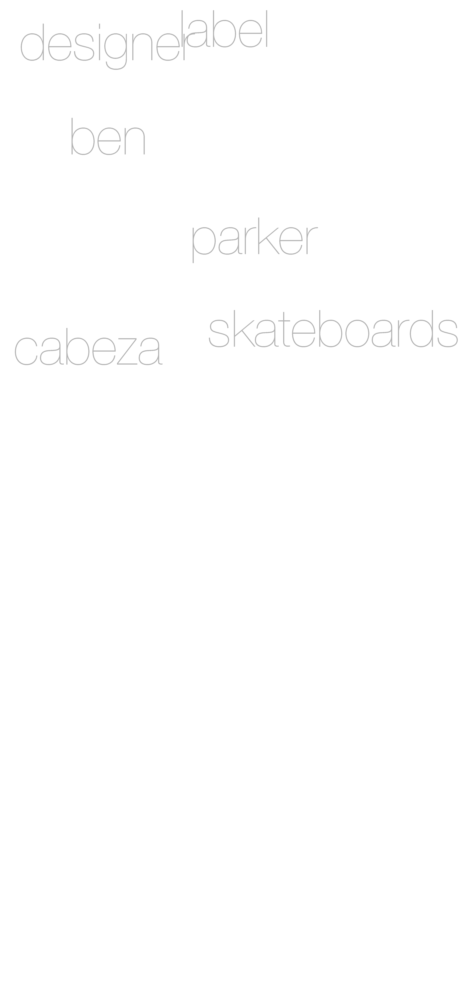
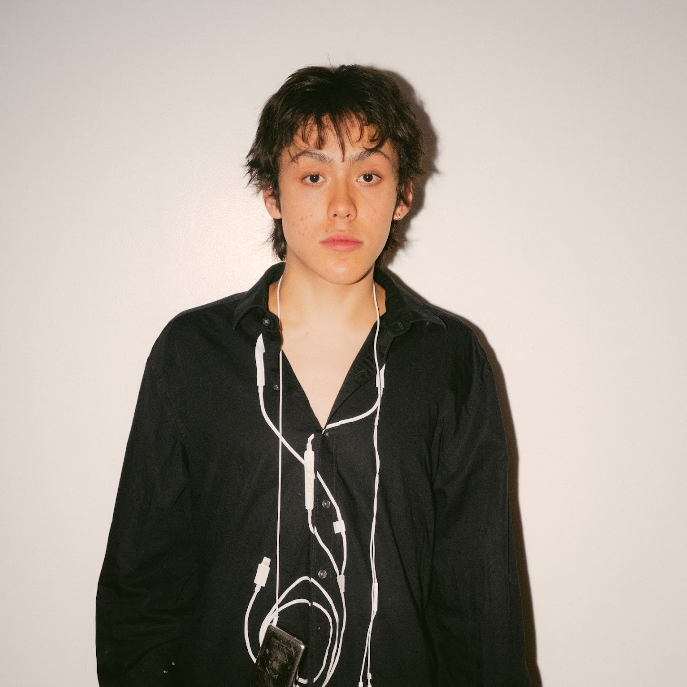

<!DOCTYPE html>
<html>
<head>
  <meta name="viewport" content="width=device-width, initial-scale=1.0" />
  
</head>
<body>
  <!-- Top banner -->
  

  <!-- Logo -->
  

  <!-- Instagram -->
  <a href="https://www.instagram.com/cab3.za/" class="insta-text">Click Here!</a>
  

  <!-- === Gallery === -->
  

    
    
    
    
    
    
    
    <!-- 372 + 373 in the middle -->
    
    
    <!-- continue -->
    
    
    
    
    
    
    
    
    
    
    
  

  
</body>
</html>
